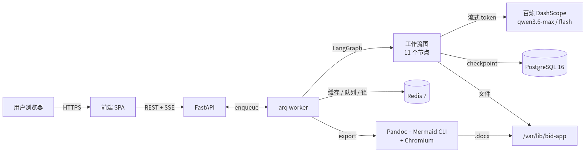

# 投标技术方案生成器（bid-app）

> 基于 LangGraph + 通义千问的中文投标技术方案自动生成与人工审核平台，把"读招标 → 拉提纲 → 写章节 → 审核修订 → 导出 docx"全链路装在一个 Web 应用里。

[](app/README.md)
[]()
[]()
[]()
[]()

---

## 它解决什么问题

写一份合格的投标技术方案要做的事：

1. 通读甲方技术规范书（几十到几百页）
2. 拆解评分细则，对照各项打分要求
3. 拟定章节大纲，与团队对齐
4. 逐章撰写专业内容（每章 3000-10000 字）
5. 反复修改、补图、调整重点
6. 排版导出 Word，给排版同事二次美化

痛点：人少、时间紧（5-7 天周期）、章节质量参差、Mermaid 图手画累、改一轮重写一遍。

这个工具做了什么：

- **三类文档自动抽取**：技术规范书 / 打分规则 / 模板范例，markitdown + LibreOffice 兼容 `.docx` `.doc` `.md` `.txt`
- **四个 LLM 分工**：LLM-0 出"材料理解"让你先对齐；LLM-1 拟提纲；LLM-2 流式写正文；LLM-3 配 Mermaid 流程图与架构图
- **模版骨架预设**（D-EF）：政企信息化-票务消费类标书已有 9 个 H1 固定骨架，LLM-1 在骨架上裁剪与展开；业绩、资质、偏离表等固定章直接走模板渲染，不调 LLM
- **章节按类型分流**（D-EG）：业务模块章必须出现三段式锚点和流程三要素；设计原则章按 `required_anchors` 严格 N 条；架构章必须命中全部层名；会议章必须含四要素。每类一套 prompt
- **锚点驱动可视化**（D-EH）：LLM-2 在流程节末尾写 `对应时序图:<flow>`，LLM-3 按锚点 1:1 出图，不再漏图错位
- **人工审核闭环**：每章生成后停下来，三按钮决策（通过 / 修订 / 跳过）；revise 时把上一轮正文和修改意见一起喂给 LLM，做局部修订而不是整章重写
- **结构化校验器**（D-EI）：merge 后自动跑 8 条规则；命中可修复错误时机器自动 revise 一次，仍失败才交给人审
- **文体规范化**（D-EJ）：行首符号 `一、二、` / `①②③` / `◆▶●` 落库前替换为 `1.` / `2.`；中英文混排自动加半角空格
- **黑板加 BM25 检索**（Phase 1A-2A）：招标材料先分到 10 个实体桶（评分细则、技术要求、资质、风险等），写章时按 BM25 召回 top-K，不再吃字符截断
- **状态机持久化**：LangGraph checkpoint 写 PostgreSQL，容器重启不丢进度，从最近成功节点续跑
- **流式打字加实时进度**：SSE 推 token，前端逐字渲染；全局进度横幅跨页可见
- **一键导出 .docx**：Pandoc + reference.docx + Mermaid PNG 中文字体，文件名 `项目名_技术方案_YYYYMMDD.docx`
- **团队共享池**：多用户可见同一项目，避免重复劳动

---

## 架构总览



源文件在 [`docs/architecture.mmd`](docs/architecture.mmd)（Mermaid 源），用容器内 `mmdc` 渲染成 PNG（中文字体 Noto CJK，透明底）。要改架构图，编辑 `.mmd` 后重新渲染即可。

工作流的 16 个 LangGraph 节点（3 个 interrupt，含 D-EI 自动 revise 回路）：

```
extract_documents
  → material_understanding → material_understanding_review (interrupt)
  → categorize_blackboard → generate_outline → parse_outline
  → outline_review (interrupt)
  → pick_chapter → chapter_generate_gate → write_chapter → gen_visuals
  → merge_chapter ─┬─ apply_auto_revise → write_chapter        # D-EI 自动重试
                   └─ human_review (interrupt) → update_state
  → pick_chapter | assemble
```

`material_understanding` 节点让 LLM-0 出一份结构化"我读到了什么"给用户对齐；`categorize_blackboard` 把材料分到 10 个实体桶给下游检索；`apply_auto_revise` 在校验器命中错误时把缺失项拼成 feedback，回送给 LLM-2 重写一次。

---

## 快速开始

完整部署方案（生产）见 [`app/README.md`](app/README.md)。

### 本地开发（macOS + Colima 或 Docker Desktop）

```bash
git clone <repo-url> bid && cd bid/app

# 1. 一键生成 .env（master_key + JWT secret）
bash scripts/gen-secrets.sh

# 2. 把百炼 API Key 留空（用户登录后在 Settings 页配置即可）

# 3. 起容器
docker compose up -d

# 4. 等 healthcheck（约 30 秒）
docker compose ps
```

打开浏览器 `http://localhost:12123`：

- 默认账号 `admin / admin123`，首次登录强制改密
- 改密后到「设置 → API Key 配置」填入百炼 Key
- 新建项目，上传 1-3 份文档（技术规范书 / 打分规则 / 模板，至少 1 份）
- 点「启动生成」，等 LangGraph 跑完进章节审核，最后导出 .docx

### 服务器部署（Ubuntu 22.04+）

```bash
# 装 docker → clone → 生成 secrets → 起容器 → 等 healthy
curl -fsSL https://get.docker.com | sh
git clone <repo-url> bid && cd bid/app
sudo ./scripts/install.sh
```

30 分钟内能跑起来。2c4g 配置可支撑 10 人共享池 + 单项目并发 ≤ 10。

### 升级既有部署

代码侧大改动（如 Stage 1-5 模版规范升级带来的 schema v3 → v4）走一次性脚本：

```bash
cd <repo-root>
git pull && ./app/scripts/upgrade-to-template-skeleton.sh
```

脚本依次：拉代码，dry-run 报数在跑项目，调 `./restart.sh` 重建容器并自动跑 alembic，flush 残留 v3 checkpoint，最后校验 `template_pack` 列、模版包加载和校验器命中。回滚指引写在脚本头部。

日常小升级（无 schema bump）走 `./restart.sh` 即可。

---

## 技术栈

| 层 | 选型 | 关键决策 |
|---|---|---|
| 前端 | Vite + React 18 + TypeScript + TanStack Query + shadcn/ui + Tailwind | SSE 流式，Mermaid 客户端自渲，mock 双模式，Vercel Web Interface Guidelines 二轮精修 |
| 后端 API | FastAPI + Pydantic + SQLAlchemy 2.0 async + Alembic | 单 deps.py 两阶段（M1 dev stub → M2 完整 JWT，D-EC） |
| 工作流 | LangGraph 0.6 + AsyncPostgresSaver | 16 节点（含 3 个 interrupt 与 D-EI 自动 revise 回路），checkpoint 续跑，state schema v4 |
| 任务队列 | arq + Redis 7 | `max_tries=1`（D-AY），失败靠用户手动 retry |
| LLM | LiteLLM → 阿里百炼 DashScope（OpenAI 兼容） | 四模型分工（LLM-0/1/2/3），流式、重试、token 记账 |
| 数据库 | PostgreSQL 16 + asyncpg | 10 张表，token_usage CASCADE，DocxJob 状态机 D-CV/D-CU/D-BX 全套 |
| DOCX 导出 | Pandoc + Mermaid CLI + Chromium + Noto CJK + LibreOffice headless | 串行锁，atomic rename，finalizing 四处 repair |
| 鉴权 | JWT cookie httpOnly + bcrypt + AES-GCM API Key + login throttle | 安全头三件套，全局限流 100/min，改密前 428 |
| 部署 | Docker Compose + supervisord（uvicorn + arq + cron）+ bind mount | 不引入 nginx；备份脚本 `pg_dump -F c` 凌晨 3 点 cron |

---

## 文档导航

| 文档 | 内容 | 给谁看 |
|---|---|---|
| [`README.md`](README.md)（本文件） | 项目主页，快速开始，架构 | 所有人 |
| [`USER_GUIDE.md`](USER_GUIDE.md) | 使用指南，从登录到导出 docx 的完整操作流程 | 实际写标书的用户 |
| [`rule.md`](rule.md) | 模版规则手册，从规范应答书提取的 9-H1 骨架，模块三段式，流程三要素，业绩/资质/偏离表规范 | 想做新模版包或评审输出质量的人 |
| [`optimization_plan.md`](optimization_plan.md) | Stage 1-5 优化执行计划：目标、数据模型变更、涉及文件、步骤、验收、回滚 | 维护者，后续做新一轮优化的人 |
| [`app/README.md`](app/README.md) | 部署运维：docker compose，升级，备份恢复，故障排查 | 运维与部署者 |
| [`app/REQUIREMENTS.md`](app/REQUIREMENTS.md) | 需求文档：用户故事，FR / NFR，验收标准 | 产品，评审 |
| [`app/IMPLEMENTATION_SPEC.md`](app/IMPLEMENTATION_SPEC.md) | 实施蓝图，约 7100 行，§1-§24 全栈技术决策，D-A 至 D-EJ 决策表 | 后续开发者，Code review |
| [`app/RUNTIME_TEST_REPORT.md`](app/RUNTIME_TEST_REPORT.md) | 运行时测试报告：5 阶段烟囱测试，7 个 R-* runtime bug 修复链 | QA，验证 |
| [`app/REVIEW_NOTES.md`](app/REVIEW_NOTES.md) | 代码审查记录：4 轮 milestone review 反馈，修复对账 | 维护者 |
| [`app/ACCEPTANCE_AUDIT.md`](app/ACCEPTANCE_AUDIT.md) | §23 验收 Checklist：23 条逐条核查，跨里程碑契约对账 | 验收方 |

---

## 项目状态

| 阶段 | 状态 |
|---|---|
| M0 CLI 验证 | ✅ |
| M1 后端核心 API（10 表 + 3 类 task + workflow + SSE） | ✅ |
| M2 认证 + 用户管理 + API Key | ✅ |
| M3 DOCX 导出（Mermaid 中文 + 串行锁 + 状态机） | ✅ |
| M4 前端 v1（10 路由 + 8 页面 + shadcn 9 件套） | ✅ |
| M5 部署打包（Docker + supervisord + 备份脚本） | ✅ |
| 4 轮 Code Review + 全栈 §23 验收 | ✅ |
| 14 个 🟡 nit + 38 个 Vercel 指南二轮精修 | ✅ |
| 7 个 runtime bug 修复链（passlib/bcrypt，docker，FastAPI 注解，arq API，SSE 持久化，段落空行，.doc 兼容，mermaid 白底，revise patch，启动 reconciler） | ✅ |
| Stage 1-5 模版规范升级（D-EF 骨架，D-EG 分流，D-EH 锚点，D-EI 校验器，D-EJ 文体） | ✅ |
| 真服务器 6 小时压测 + 备份恢复演练 | ⏳ 待用户跑 |

---

## 安全与合规

- API Key 真快照（FR-7.6 / D-C）：用户启动项目时把当前 API Key 加密快照拷到 `Project.encrypted_api_key_snapshot`，后续工作流读这个快照；用户删除或修改 ApiKey 不影响在跑的项目
- AES-GCM 加密 ApiKey，master_key 校验长度 64 hex
- 改密前 428 拦截 + login throttle（5 次失败锁 5 分钟，IP 维度）
- 安全头三件套：CSP，X-Frame-Options，X-Content-Type-Options
- 全局限流 100 req/min/IP
- `master_key` 一旦丢失，所有 API Key 永久不可解密。启动横幅打 sha256 前缀供运维与备份比对（R10）

---

## 已知限制

1. 单容器部署，单实例，无 HA。内网 10 人共享池场景够用
2. PostgreSQL 数据卷崩了，workflow checkpoint 全丢。建议每天 pg_dump（脚本已就绪）
3. LLM 长文本生成偶尔超 60 秒 idle 触发 SSE 重连，已通过 SSE 心跳和 DB persistent flush 兜底
4. Mermaid 客户端渲染：极少数老语法 LLM 输出可能渲染失败。已加 fallback 显示源码 + mermaid.live 一键调试
5. 不支持 `.pdf` / `.ppt` 直接抽取（markitdown + libreoffice 不覆盖）。用户需先转 `.docx`

---

## License

内部使用。本项目所有代码与文档由实施团队完成，含 Co-Authored-By Claude Opus 4.7 (1M context) 标注。
