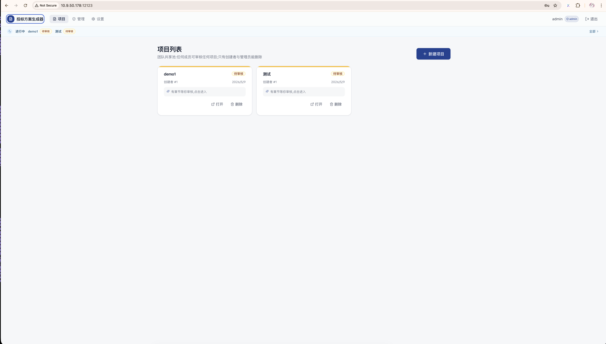
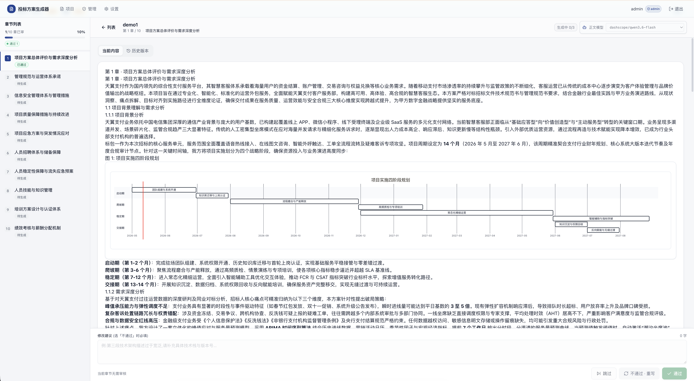
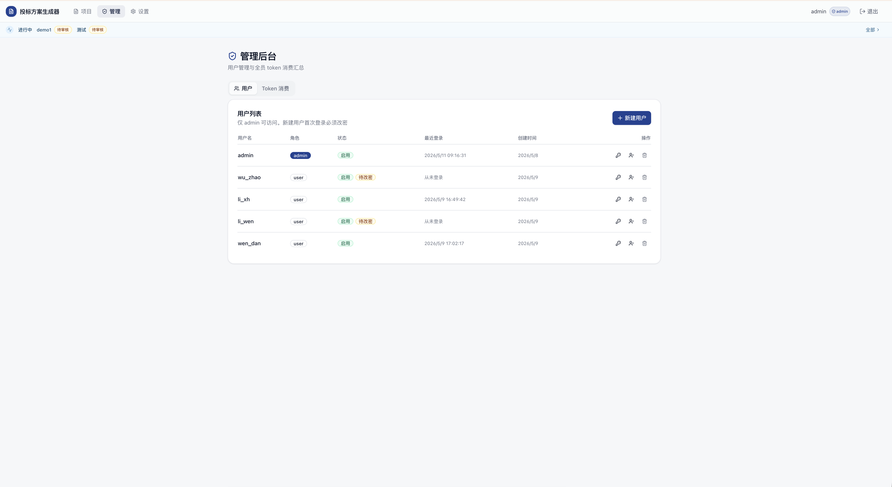
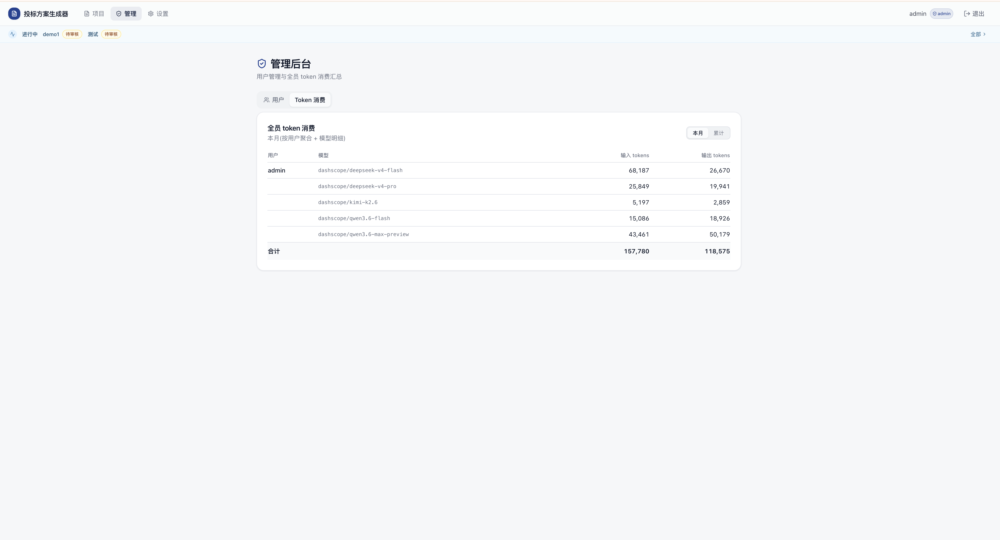
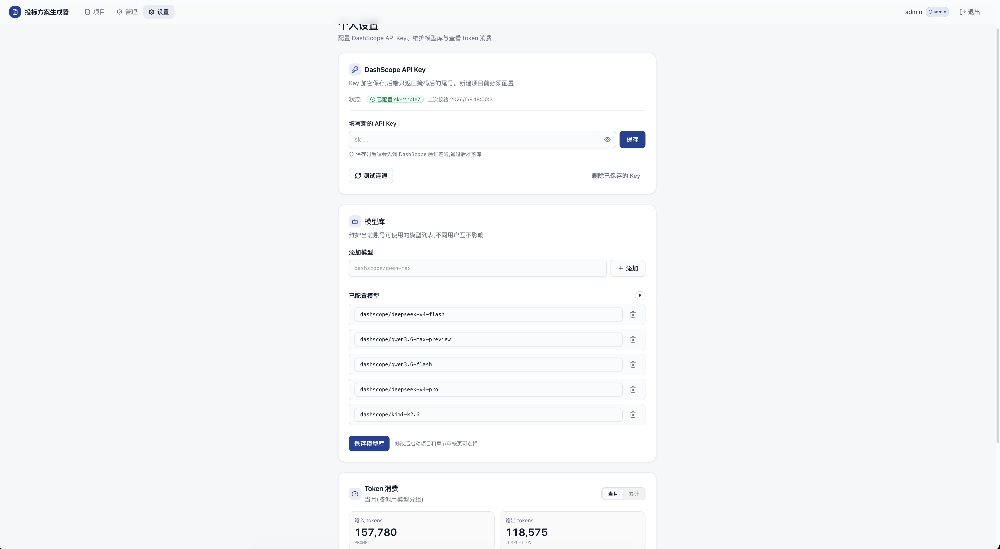

## 一、项目介绍

本工程是一个面向投标团队的内网 Web 应用，用 AI 辅助完成“读招标文件、拆评分项、生成技术方案提纲、逐章撰写、人工审核修订、导出 Word”的完整流程。

它是一个带项目管理、人工审核、版本留痕、用户权限、模型配置、token 消耗统计和 Word 导出的业务系统。核心目标是把投标技术方案从“个人经验驱动、手工反复改稿”升级为“资料输入、AI 初稿、人审把关、流程留痕”的可管理流程。

访问地址：http://10.9.50.178:12123
体验账号：test
体验密码：test1123!
需要公司内网访问

## 二、主要解决的问题

| 管理问题              | 当前系统的解决方式                         |
| ----------------- | --------------------------------- |
| 标书技术方案撰写周期紧、重复劳动多 | 上传招标技术规范、评分规则、历史模板后，系统自动生成提纲和章节初稿 |
| 内容质量不稳定，容易漏掉评分项   | 提纲生成阶段会结合评分规则，章节按提纲逐项展开           |
| AI 直接出稿风险高        | 每章生成后必须人工审核，可选择通过、修订或跳过           |
| 修改意见难沉淀           | 修订意见会进入下一轮生成，章节历史版本可追溯            |
| 多人协作缺少统一入口        | 团队共享项目池，成员可接力审核项目                 |
| AI 成本不可见          | 个人和管理员均可查看 token 消耗，支持按模型、按用户统计   |
| API Key 管理不安全     | Key 加密保存，前端不回显明文，项目启动时生成加密快照      |

## 三、系统功能范围

### 已覆盖能力

- 账号登录、首次登录强制改密、管理员用户管理。
- 团队共享项目池，支持创建、查看、删除项目。
- 上传技术规范书、打分规则、方案模板三类资料。
- 支持 `.docx`、`.doc`、`.md`、`.txt` 文档抽取。
- 自动生成投标方案章节提纲，并支持人工确认和编辑。
- 逐章生成方案正文，正文支持流式展示。
- 每章人工审核，支持“通过 / 不通过重写 / 跳过”。
- 支持章节失败后的手动重试。
- 支持章节历史版本查看。
- 支持 Mermaid 图表和 Markdown 表格渲染。
- 支持完整方案预览、下载 Markdown、按需生成 Word 文档。
- 支持用户级 DashScope API Key 配置、模型库维护、token 消耗统计。
- 管理员可查看全员用户和 token 消耗。

## 四、业务流程

| 阶段 | 使用动作 | 系统输出 |
|---|---|---|
| 1. 准备 | 登录系统，配置个人 DashScope API Key | 用户具备生成权限 |
| 2. 立项 | 新建投标项目，填写名称和说明 | 项目进入共享池 |
| 3. 资料输入 | 上传技术规范、评分规则、模板范例 | 系统抽取为结构化文本 |
| 4. 提纲生成 | AI 综合资料生成章节提纲 | 8-15 章左右的方案骨架 |
| 5. 提纲确认 | 人工检查、编辑、确认 | 进入逐章生成 |
| 6. 章节生成 | AI 逐章撰写正文和图表建议 | 每章 Markdown 正文 |
| 7. 人工审核 | 通过、修订、跳过 | 质量受控的章节稿 |
| 8. 全文输出 | 汇总所有已确认章节 | 完整技术方案 |
| 9. 交付 | 下载 `.md` 或 `.docx` | 给投标/排版团队继续处理 |

## 五、界面与功能说明

### 1. 项目列表：团队项目统一入口

项目列表展示所有团队项目。截图中可以看到系统已运行在内网地址，当前有 `demo1`、`测试` 等项目处于“待审核”状态，说明项目已经进入章节审核阶段。

管理价值：

- 所有项目集中展示，便于总览当前投标工作量。
- 项目状态清晰标记，能快速识别哪些项目在生成、待审或已完成。
- 共享池模式支持成员接力处理，减少“项目只在某个人电脑里”的风险。

### 2. 章节审核：AI 生成后由人工把关

章节审核页是系统的核心工作台。左侧是章节列表和整体进度，右侧是当前章节正文，底部是审核操作区。截图中 `demo1` 项目共有 10 章，当前第 1 章已通过，其余章节等待生成或审核。

管理价值：

- AI 只负责出初稿，是否进入最终方案由人决定。
- 审核人可以填写具体修改意见，让系统按反馈重写。
- 每章状态可见，避免长文档一次性生成后才发现方向错误。
- 支持章节级模型选择，便于在成本、速度、质量之间做取舍。
- 支持历史版本查看，方便追溯“为什么改、改了几轮”。

### 3. 管理后台：用户和权限集中管理

管理员页面提供用户列表、新建用户、启用/禁用、重置密码、删除等能力。截图中可见管理员 `admin` 以及多个普通用户，部分用户处于“待改密”状态。

管理价值：

- 账号由管理员统一创建，不开放自助注册。
- 新用户首次登录必须改密，降低默认密码长期使用风险。
- 可禁用离职、转岗或临时停用账号。
- 用户角色分为 `admin` 和 `user`，管理员具备用户与消耗管理权限。

### 4. Token 消耗：AI 使用成本可统计

管理员可查看全员 token 消耗，支持按当月和累计切换。截图中展示了不同模型的输入 token、输出 token，以及合计消耗。

管理价值：

- 可以按用户、按模型追踪 AI 使用量。
- 支持费用核算、预算控制和异常消耗排查。
- 有助于后续制定“哪些项目适合用高质量模型，哪些可用快速模型”的管理规则。

### 5. 设置页：API Key、模型库和个人消耗

设置页用于配置个人 DashScope API Key、维护可用模型列表，并查看个人 token 消耗。截图显示 Key 已配置，系统仅展示脱敏尾号，并记录上次校验时间。

管理价值：

- API Key 加密保存，前端不回显明文。
- 保存前后都可以测试连通，减少生成时才发现 Key 不可用。
- 支持维护模型库，适配不同生成任务的质量和成本需求。
- 个人可自查使用量，减少成本管理只靠管理员事后追踪。

## 六、当前状态

当前已具备完整业务闭环：

- 项目列表、章节审核、设置、管理后台等核心页面已经可访问。
- 后端路由覆盖项目、文档、提纲、章节审核、重试、导出、用户、API Key、token 统计。
- 工作流已按 LangGraph 节点拆分，支持提纲确认和章节审核两个暂停点。
- 已有 Docker Compose 部署、备份脚本、运行文档和验收文档。

现已给巫钊、李雯、李雄汉、文丹开账号体验，等待反馈并进一步优化。
