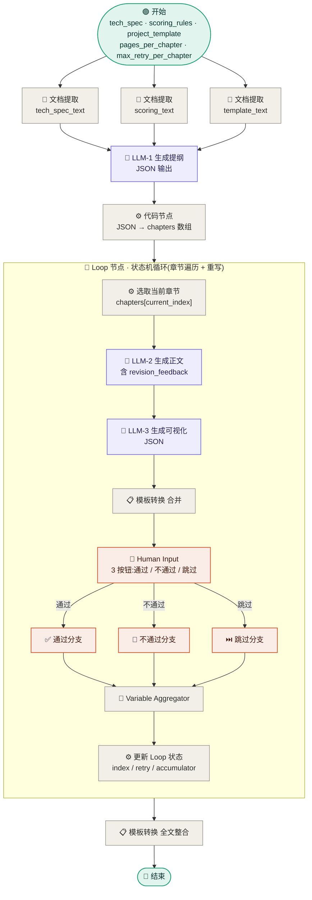

> **平台**:Dify v1.13.0+(自托管推荐) **应用类型**:Workflow(任务型,带人工审核) **版本**:v10.0-Dify **来源**:在 v9.0(Dify 全自动)的基础上,**加回 v7 风格的人工审核环节** **关键依赖**:**Dify ≥ 1.13.0**(因为用了 Human Input 节点,这是 1.13.0 新增功能) **预计搭建时间**:35-50 分钟

---

## 一、v10 与 v9 的核心差异

### 1.1 为什么有 v10?

v9 是全自动流程,跑完一遍直接出稿,没有人工把关。但很多投标场景需要"每章生成完先让人审核 → 通过则继续 → 不通过带反馈重写"。

百炼任务型工作流没有问答节点,所以 v8 退回到全自动;Dify 在 **v1.13.0(2026 年初)新增了 Human Input 节点**,Workflow 模式现在原生支持人工介入。所以可以做 v10:**Dify Workflow + 人工审核反馈环**。

### 1.2 用什么节点实现"反馈环"

Dify 不支持循环嵌套(iteration 内不能嵌套 iteration / loop),所以原本的"外层遍历章节 + 内层重写直到通过"双层结构在 Dify 也搭不出来。

但 Dify 的 **Loop 节点**(v1.2.0 引入)是天然的状态机循环 — 用 Loop 变量管理 `current_index`、`retry_count`、`finalized_chapters`、`revision_feedback`,**单层 Loop 同时驱动"章节遍历"和"重写循环"**。这本质上就是 v6.0 在百炼上做的扁平化方案,只不过 Dify 的 Loop 节点天然支持状态机循环,不需要回边技巧。

### 1.3 v10 与 v9 节点对照

|v9 (全自动)|v10 (含审核)|变化|
|---|---|---|
|§4.5 Iteration 节点|§4.5 **Loop 节点**|⭐ Iteration 改 Loop,4 个 Loop 变量管理状态|
|§4.5.1 LLM-2|§4.5.2 LLM-2|提示词加上 `revision_feedback` 反馈段|
|§4.5.2 LLM-3|§4.5.3 LLM-3|不变|
|§4.5.3 模板转换 合并|§4.5.4 模板转换 合并|不变|
|(无)|§4.5.1 选取当前章节(代码)|⭐ 新增 — 从 chapters 数组按 index 取章节|
|(无)|§4.5.5 **Human Input 审核**|⭐ 新增 — 3 按钮:通过/不通过/跳过|
|(无)|§4.5.6 三分支聚合|⭐ 新增 — Variable Aggregator|
|(无)|§4.5.7 更新 Loop 状态(代码)|⭐ 新增 — 决定 index/retry/累积 怎么变|
|§4.6 全文整合|§4.6 全文整合|不变|
|§4.7 chapter_count|§4.7 chapter_count|不变|
|§4.8 结束|§4.8 结束|不变|

子画布节点数从 v9 的 3 个增加到 v10 的 7 个,但**整体复杂度仍然低于 v7 百炼**(v7 是 11 个,且每个 LLM 节点前都要组装脚本)。

---

## 二、流程总览



> 紫色 = LLM 节点;橙色 = 人工审核反馈环关键节点;绿色 = 入口/出口;灰色 = 辅助。
> 
> **Loop 节点的精妙之处**:`current_index` 由"通过分支" +1,由"不通过分支"保持不变。终止条件是 `current_index >= len(chapters)`。这样**单层 Loop 同时驱动"章节遍历"和"重写直到通过"两件事**,完全 DAG,不需要回边。

---

## 三、全局变量 Schema

### 3.1 开始节点入参

| 变量名                     | 类型     | 必填  | 默认  | 说明             |
| ----------------------- | ------ | --- | --- | -------------- |
| `tech_spec`             | File   | ✅   | —   | 技术需求文档         |
| `scoring_rules`         | File   | ✅   | —   | 打分规则文档         |
| `project_template`      | File   | ✅   | —   | 技术方案模板         |
| `pages_per_chapter`     | Number | —   | 3   | 每章预期页数         |
| `max_retry_per_chapter` | Number | —   | 3   | 单章最大重写次数(防死循环) |

### 3.2 结束节点出参

| 变量名              | 类型     | 来源     |
| ---------------- | ------ | ------ |
| `final_proposal` | string | 全文整合节点 |
| `chapter_count`  | number | 全文整合节点 |

### 3.3 Loop 节点的 Loop 变量(v10 关键)

Loop 变量是 Dify Loop 节点的状态,在多轮循环间持久化,并在循环结束后供下游节点使用。

|变量名|类型|初值|说明|
|---|---|---|---|
|`current_index`|Number|`0`|当前处理的章节索引|
|`retry_count`|Number|`0`|当前章节已重写轮数|
|`finalized_chapters`|Array[String]|`[]`|累积已通过的章节|
|`revision_feedback`|String|`""`|当前章节累积的修改建议|

> ⚠️ Loop 变量必须在 Loop 节点配置面板里**事先声明**(包括类型和初值),不能在子画布里临时创建。声明后,子画布末尾的"更新状态"节点的输出会自动覆盖这些 Loop 变量。

---

## 四、节点配置详情

### 4.0 ⚠️ Jinja2 引用规则(本章所有 LLM 节点必读)

Dify LLM 节点的 USER 提示词框右上角有一个 **`Jinja` 开关**。打开后,模板支持 `` `` 等控制语法 — 但**模板里只能引用本节点「输入变量(jinja2_variables)」面板里声明过的短变量名**,**不能**直接写 `pick_chapter.current_chapter.title`、`extract_tech_spec.text`、`chapter_loop.revision_feedback` 这种跨节点路径。

正确流程:

1. **在 USER 框上方把 `Jinja` 开关打开**
2. **在节点底部找到「输入变量」面板**(对应 DSL 里的 `jinja2_variables`),点 `+`
3. **变量名**自己起一个短名(如 `current_chapter`、`text_1`),**值**用变量选择器从上游节点选(如 选取当前章节 / current_chapter)
4. **Jinja 模板里只用短名**,Object 类型用 `.field` 点语法访问字段

> Object 输入变量(如 `current_chapter`)绑定后,其内部字段 `.title` `.summary` `.key_points` 等可以直接在 Jinja 里点语法访问,**不需要**给每个字段单独绑一个输入变量。
>
> 模板转换节点(Template Transform)和 Human Input 节点也是这个规则:输入变量面板绑定 → 模板里短名引用。

---

### 4.1 开始节点

**类型**:Start(Dify 内置)

**节点名**:`start`(显示名:用户输入)

**配置**:点击节点 → "+ 添加变量",依次添加 5 个变量:

| 变量名 | 显示标签 | 类型 | 必填 | 默认值 | 文件类型限制 | 说明 |
|---|---|---|---|---|---|---|
| `tech_spec` | 技术需求文档 | File | ✅ | — | document(PDF/DOCX/TXT/MD)| 招标方提供的需求/招标书 |
| `scoring_rules` | 打分规则文档 | File | ✅ | — | document | 评标办法/打分细则 |
| `project_template` | 技术方案模板 | File | ✅ | — | document | 自家或行业方案模板 |
| `pages_per_chapter` | 每章预期页数 | Number | 否 | `3` | — | 总体期望(LLM-1 提纲会按打分权重微调到 1-6 页)|
| `max_retry_per_chapter` | 单章最大重写次数 | Number | 否 | `3` | — | 防死循环兜底,每章最多重写 N 轮后强制累积 |

> File 类型变量在配置面板里:**类型选 File → 允许的文件类型勾"document" → 上传方式勾"local_file"和"remote_url"**。不要勾"image",防止误传。

---

### 4.2 文档提取器 ×3(并行)

**类型**:Document Extractor(文档提取器,内置)

**作用**:从上传的 PDF / DOCX / TXT / MD 中抽取纯文本,供下游 LLM 使用。

**三个节点完整配置**:

| 节点 ID | 显示名 | 输入变量(`variable_selector`) | is_array_file | 输出变量(自动) |
|---|---|---|---|---|
| `extract_tech_spec` | 提取技术需求 | 用户输入 / tech_spec | false | `text`(String) |
| `extract_scoring` | 提取打分规则 | 用户输入 / scoring_rules | false | `text`(String) |
| `extract_template` | 提取方案模板 | 用户输入 / project_template | false | `text`(String) |

**节点参数**(三个节点都一样):

| 字段 | 值 | 说明 |
|---|---|---|
| 类型 | Document Extractor | — |
| 解析引擎 | 默认(Unstructured) | 自托管 Pro 版可改"LLM extraction" |
| is_array_file | false | 单文件,不是数组 |

**连线**:开始节点 → 3 个文档提取器**并行**(三条独立边)→ 全部汇入 LLM-1。

> ⚠️ 三个提取器节点的 `text` 输出在 LLM-1 的 Jinja 输入变量里**会重名**,Dify 会自动加 `_1`/`_2` 后缀(`text` / `text_1` / `text_2`)。绑定时按 §4.3 的对应顺序。
>
> 如果你的打分规则文档含合并单元格的复杂表格,默认 Unstructured 抽出来会丢列对齐,这时候要么:① 在自托管 Pro 版里把这一个提取器改成 LLM extraction 模式;② 在提取器后加一个 LLM 节点专门做表格还原。

---

### 4.3 LLM-1 · 生成技术方案提纲

**类型**:LLM(内置)

**节点名**:`llm_1_outline`(显示名:生成技术方案提纲)

**作用**:综合 3 份输入文档(需求/打分/模板),输出一份结构化的章节提纲 JSON,作为下游章节循环的输入。

**模型与参数**(完整列表):

| 字段 | 值 | 说明 |
|---|---|---|
| 模型 | `qwen3.5-plus` 或 `deepseek-v4-flash` 或 `gpt-4o` | 提纲设计需要较强逻辑能力,推荐用 Plus 系列而不是 Flash |
| 模式 | Chat | — |
| **Max Tokens** | **6144** | ⭐ 默认 4096 在 15 章 + 完整字段时会撞顶,提到 6144 留余量 |
| Temperature | 0.3 | 提纲要严谨稳定 |
| Top P | 0.9 | 默认 |
| **Response Format** | **JSON Object** | 模型支持时必选,否则下游 §4.4 解析容易失败 |
| Frequency Penalty | 0 | — |
| Presence Penalty | 0 | — |
| 视觉 | 关闭 | — |
| 上下文 | 关闭 | — |
| 失败重试 | 开启,2 次,间隔 1000 ms | JSON 解析重试 |

**系统提示词**(SYSTEM):

```text
你是一位资深技术方案架构师,深耕投标方案撰写 10 年以上。你的任务是综合分析用户提供的技术需求文档、打分规则与方案模板,输出一份结构化、覆盖度高、能精准对应打分项的章节提纲。

你必须严格遵守以下规则:
1. 章节设计必须紧扣打分规则的各项权重——权重高的内容用更多章节或更深篇幅
2. 章节结构应参照方案模板的层级,但允许根据需求实际调整
3. 输出严格的 JSON 格式,不要任何前后缀文字、不要 markdown 代码块包裹
4. 每章必须含明确的关键点列表,便于后续撰写时聚焦
5. 章节数量控制在 8-15 个之间
```

**用户提示词**(USER)⭐ Dify Jinja2 模式必须先声明变量:

**先在 USER 框右上角把 `Jinja` 开关打开**,然后**在节点底部的「输入变量(jinja2_variables)」面板**绑定 3 个变量:

| 短变量名(Jinja 里用这个) | 来源(从变量选择器选) |
|---|---|
| `text` | extract_tech_spec / text |
| `text_1` | extract_scoring / text |
| `text_2` | extract_template / text |

> ⚠️ Dify Jinja2 节点**不允许**在模板里直接写 `extract_tech_spec.text` 这种跨节点路径,必须先在输入变量面板把它绑成短名。多个同名变量会自动加 `_1`/`_2` 后缀。

**Jinja 模板**:

```jinja
请基于以下三份资料,为本次投标设计技术方案章节提纲。

## 一、技术需求文档
{{ text }}

## 二、打分规则(请特别关注各项权重)
{{ text_1 }}

## 三、方案模板(参照其结构层级)
{{ text_2 }}

---

请输出 JSON 格式提纲,严格遵循以下 schema:

{
  "chapters": [
    {
      "id": "ch_01",
      "title": "章节标题(简洁有力)",
      "summary": "本章核心要点摘要(80 字以内)",
      "key_points": ["要点 1", "要点 2", "要点 3"],
      "target_pages": 3,
      "matched_scoring_items": ["对应的打分项名称"]
    }
  ]
}

要求:
- 8-15 个章节为宜
- target_pages 根据打分权重和内容深度分配 1-6 页
- key_points 每章 3-7 个
- matched_scoring_items 列出本章主要覆盖的打分项

请只输出 JSON 字符串,不要任何其他文字。
```

**输出**:`text`(节点自带)

---

### 4.4 代码节点 · 解析提纲

**类型**:Code(Python,内置)

**节点名**:`parse_outline`(显示名:解析提纲)

**作用**:把 LLM-1 输出的 JSON 字符串解析成结构化的章节数组,做字段兜底/类型校验,顺便输出总章节数供下游 Loop 终止条件和全文整合用。

**代码语言**:`python3`

**输入变量**(配置面板):

| 变量名 | 来源 | 类型 |
|---|---|---|
| `outline_json` | 生成技术方案提纲 / text | String |

**输出变量**(配置面板,**类型必须严格声明**):

| 变量名 | 类型 | 说明 |
|---|---|---|
| `chapters` | Array[Object] | 标准化后的章节数组(每个元素含 id/title/summary/key_points/target_pages/matched_scoring_items 6 字段) |
| `total_chapters` | Number | 章节总数,Loop 节点终止条件 `current_index ≥ total_chapters` 用 |

**代码**(Python,直接复制):

```python
import json
import re

def main(outline_json: str) -> dict:
    """解析 LLM-1 输出的提纲 JSON,标准化字段后返回章节数组。"""

    # 容错:去除可能的 markdown 代码块包裹
    text = (outline_json or "").strip()
    text = re.sub(r'^```(?:json)?\s*', '', text)
    text = re.sub(r'\s*```$', '', text)

    try:
        data = json.loads(text)
    except json.JSONDecodeError:
        # 兜底:抽取第一个 { 到最后一个 }
        match = re.search(r'\{[\s\S]*\}', text)
        if match:
            try:
                data = json.loads(match.group())
            except json.JSONDecodeError:
                data = {}
        else:
            data = {}

    chapters = data.get('chapters', []) if isinstance(data, dict) else []

    # 标准化每章字段
    normalized = []
    for i, ch in enumerate(chapters):
        if not isinstance(ch, dict):
            continue
        ch.setdefault('id', f'ch_{i+1:02d}')
        ch.setdefault('title', f'第 {i+1} 章')
        ch.setdefault('summary', '')
        ch.setdefault('key_points', [])
        ch.setdefault('target_pages', 3)
        ch.setdefault('matched_scoring_items', [])

        # 类型校验
        if not isinstance(ch['target_pages'], (int, float)):
            try:
                ch['target_pages'] = int(ch['target_pages'])
            except (ValueError, TypeError):
                ch['target_pages'] = 3
        if not isinstance(ch['key_points'], list):
            ch['key_points'] = [str(ch['key_points'])]
        if not isinstance(ch['matched_scoring_items'], list):
            ch['matched_scoring_items'] = []

        normalized.append(ch)

    return {
        'chapters': normalized,
        'total_chapters': len(normalized),
    }
```

**节点参数**:

| 字段 | 值 |
|---|---|
| 失败时重试 | 关闭(代码节点确定性高,不需要重试) |
| 异常处理 | 无 |

> ⚠️ Dify 代码节点对**输出类型严格匹配** —— 声明 `chapters: Array[Object]`,函数就必须返回 `list[dict]`;声明 `total_chapters: Number`,就必须返回 `int` 或 `float`。返回 `None` 或类型不符会报"输出类型不匹配"。

---

### 4.5 Loop 节点本体配置 ⭐ v10.0 核心

**类型**:Loop(循环节点,内置,Dify v1.2+)

**节点名**:`chapter_loop`(显示名:循环)

**作用**:用状态机循环驱动"章节遍历"和"重写直到通过"两件事。`current_index` 由"通过/跳过"分支 +1,由"不通过"分支保持不变 → 单层 Loop 同时驱动两件事。

**配置面板**(Loop 节点本身,**不进入子画布**):

| 字段 | 值 | 说明 |
|---|---|---|
| 节点名(标识符) | `chapter_loop` | 不要中文,Dify DSL 用此 ID |
| 显示标题 | 循环 | 画布上显示的中文名 |
| **Loop Termination Condition(终止条件)** | `current_index ≥ total_chapters` | 比较运算符选 `≥`,左侧选「循环 / current_index」(Number,变量类型),右侧选「解析提纲 / total_chapters」(Number,变量类型) |
| 逻辑运算符(多条件时) | AND | 单条件可忽略 |
| **Maximum Loop Count(最大次数)** | `60` | 兜底防死循环。10 章 × 4 轮(3 重写+1 通过)= 40,留余量 60 |
| 异常处理模式(error_handle_mode) | `terminated` | 子画布报错时立即终止整个 Loop,不继续下一轮 |

**Loop Variables 详细配置**(在节点面板 "+ 添加循环变量" 里逐个加,共 5 个):

| 变量名(label) | 类型(var_type) | 初值 | 是否需要外部赋值 | 来源(value_selector) |
|---|---|---|---|---|
| `current_index` | Number | `0` | 否(初值即可) | — |
| `retry_count` | Number | `0` | 否 | — |
| `finalized_chapters` | Array[String] | `[]` | 否 | — |
| `revision_feedback` | String | `""` | 否 | — |
| `chapters_array` | Array[Object] | (无初值) | ⭐ **是** | 解析提纲 / chapters |

> ⚠️ Loop 变量类型**必须严格匹配**:`current_index` 是 Number 不是 String,`finalized_chapters` 是 Array[String] 不是 Array[Object]。类型不符会导致 §4.5.7 状态更新节点写不回 Loop 变量,Loop 永远跑第 0 章。
>
> ⚠️ `chapters_array` 是**唯一需要外部赋值**的 Loop 变量,因为它存的是从 §4.4 解析提纲来的数据,不是循环过程中产生的。其他 4 个变量是 Loop 自己维护的状态,只需要初值。

**输出变量**(Loop 结束后供下游使用):

Loop 节点结束后,**所有 Loop 变量的最终值**都自动作为节点输出,可在下游节点的变量选择器里看到:

| 输出名 | 类型 | 典型用法 |
|---|---|---|
| `current_index` | Number | 用于诊断:是否所有章节都跑完了 |
| `retry_count` | Number | 最后一章的重试轮数,通常 0 |
| **`finalized_chapters`** | **Array[String]** | ⭐ 主输出,§4.6 全文整合用它 |
| `revision_feedback` | String | 通常为空 |
| `chapters_array` | Array[Object] | 原样透传,可备审计用 |

**子画布拓扑**(完全 DAG):

```
Loop 开始
   ↓
[4.5.1] 选取当前章节(代码)
   ↓
[4.5.2] LLM-2 生成正文
   ↓
[4.5.3] LLM-3 生成可视化
   ↓
[4.5.4] 模板转换 合并 → full_chapter
   ↓
[4.5.5] Human Input 审核
   ├─ 通过 ──→ [Pass 标记]    ─┐
   ├─ 不通过 ─→ [Revise 标记]   ├─→ [4.5.6] Variable Aggregator
   └─ 跳过 ──→ [Skip 标记]     ─┘
                                    ↓
                          [4.5.7] 更新 Loop 状态(代码)
                                    ↓
                                Loop 自动检查终止条件,继续或退出
```

子画布内一共 7 个内容节点(Human Input 输出 3 个标记节点,可以用 3 个简单的 Code 节点或 Variable Assigner 实现)。

---

### 4.5.1 选取当前章节(代码节点)

**类型**:Code(Python)

**节点名**:`pick_chapter`(显示名:选取当前章节)

**位置**:Loop 子画布的**第一个节点**,从 `1777455673267start`(Loop 起点)出来直接连到它。

**作用**:每轮循环开始时,根据当前 `current_index` 从 `chapters_array` 数组里取出当前要处理的那一章,作为后续 LLM-2/LLM-3/合并节点的输入。

**代码语言**:`python3`

**输入变量**(配置面板,**用变量选择器选**,不要手敲 `${chapter_loop.xxx}`):

| 变量名 | 来源 | 类型 |
|---|---|---|
| `chapters` | 循环 / chapters_array | Array[Object] |
| `current_index` | 循环 / current_index | Number |

**输出变量**:

| 变量名 | 类型 | 说明 |
|---|---|---|
| `current_chapter` | Object | 当前章节对象,含 6 个字段 |

**节点参数**:

| 字段 | 值 |
|---|---|
| 失败时重试 | 关闭 |
| 异常处理 | 无 |

**代码**:

```python
def main(chapters: list, current_index: int) -> dict:
    """从 chapters 数组按 index 取出当前章节。"""
    if not isinstance(chapters, list) or not chapters:
        return {'current_chapter': {}}

    try:
        idx = int(current_index)
    except (ValueError, TypeError):
        idx = 0

    if idx < 0 or idx >= len(chapters):
        return {'current_chapter': {}}

    chapter = chapters[idx]
    if not isinstance(chapter, dict):
        return {'current_chapter': {}}

    # 兜底字段
    chapter.setdefault('id', f'ch_{idx+1:02d}')
    chapter.setdefault('title', '')
    chapter.setdefault('summary', '')
    chapter.setdefault('key_points', [])
    chapter.setdefault('matched_scoring_items', [])
    chapter.setdefault('target_pages', 3)

    return {'current_chapter': chapter}
```

---

### 4.5.2 LLM-2 · 生成章节正文 ⭐ v10 改:加入反馈段

**类型**:LLM

**节点名**:`llm_2_chapter`(显示名:生成章节正文)

**模型与参数**(完整列表):

| 字段                | 值                                    | 说明                                    |
| ----------------- | ------------------------------------ | ------------------------------------- |
| 模型                | `qwen3.6-plus` 或 `deepseek-v4-flash` | 单章正文最长 4-5 页,需要长输出能力                  |
| 模式                | Chat(对话补全)                           | LLM 节点默认                              |
| **Max Tokens**    | **32768**                            | ⭐ 不要用默认 8192!4-5 页章节会被截断。详见下方"输出长度估算" |
| Temperature       | 0.6                                  | 平衡创造性与一致性,反馈重写时也保持 0.6                |
| Top P             | 0.9                                  | 默认即可                                  |
| Response Format   | Text                                 | 输出 Markdown 文本,不是 JSON                |
| Frequency Penalty | 0                                    | 默认                                    |
| Presence Penalty  | 0                                    | 默认                                    |
| 视觉(Vision)        | 关闭                                   | 不需要图像理解                               |
| 上下文(Context)      | 关闭                                   | 不挂知识库                                 |
| **失败重试**          | **开启,2 次,间隔 1000 ms**                | 防瞬时网络/限流                              |

> **输出长度估算**:中文 1 字 ≈ 1.6-2.0 token。5 页章节下限 4000 字,模型常写 1.5 倍 ≈ 6000 字 ≈ 9600-12000 token。带表格章节 token 密度更高。8192 顶住 3-4 页就到天花板,16384 给 5 页留 25% 余量,**32768 是绝不被截断的稳妥值**。如果你的模型最大只支持 16384(部分 qwen-flash 系列),退而求其次设 16384 + SYSTEM 加字数上限约束。

**系统提示词**(SYSTEM,纯文本,**不要**开 Jinja):

```text
你是技术方案撰写专家,擅长将章节大纲扩展为深入、专业、可读性强的 Markdown 正文。

撰写规则:
1. 严格使用 Markdown 格式输出,不要使用一级标题(# 标题),从二级标题(## 标题)开始
2. 字数控制: 每页约 800 字,严格在「目标字数」到「目标字数 × 1.3」之间,不允许少于下限,也不允许超出 1.3 倍上限
3. 风格: 专业、严谨、条理清晰; 适当使用项目符号、有序列表、表格增强可读性
4. 不要写"以下是..."、"本章将..."这类元描述,直接进入正文
5. 章节末尾不要写"以上即为本章内容"等总结句
6. 技术细节要准确,涉及具体数字时给出来源或合理范围
7. 关键概念首次出现时简要解释,避免读者困惑

如果用户提示词中包含上一轮的修改建议,你必须严格按建议重写,不要做形式上的调整,要做实质性的重新组织和补充。
```

**用户提示词** ⭐ v10 在 v9 基础上加反馈段:

**USER 框打开 `Jinja` 开关**,然后在节点底部「输入变量(jinja2_variables)」面板绑定 3 个变量:

| 短变量名 | 来源 | 类型 |
|---|---|---|
| `current_chapter` | 选取当前章节 / current_chapter | Object |
| `revision_feedback` | 循环 / revision_feedback | String |
| `retry_count` | 循环 / retry_count | Number |

> ⚠️ Loop 变量(`revision_feedback`、`retry_count`)在 Jinja 模板里**不能直接写 `chapter_loop.xxx`**,必须先在输入变量面板从「循环」节点选过来绑成短名。`current_chapter` 是 Object,绑过来后用 `.title` `.id` 等点语法访问其字段。

**Jinja 模板**:

```jinja
请撰写以下章节的完整 Markdown 正文。

## 章节信息
- **章节标题**: {{ current_chapter.title }}
- **章节 ID**: {{ current_chapter.id }}
- **要点摘要**: {{ current_chapter.summary }}
- **目标页数**: {{ current_chapter.target_pages }} 页
- **目标字数**: {{ current_chapter.target_pages * 800 }} 字以上

### 必须覆盖的关键点


- {{ p }}


### 对应的打分项


- {{ s }}



====================
⚠️ 本章上一轮人工审核未通过(第 {{ retry_count }} 轮),修改建议如下:

{{ revision_feedback }}

请严格依据以上建议重写本章,不要简单微调或换措辞,需要做实质性的重新组织、补充内容、修正问题。
====================


请直接输出本章 Markdown 正文,不要前后缀说明。
```

---

### 4.5.3 LLM-3 · 生成可视化元素

**类型**:LLM

**节点名**:`llm_3_visual`(显示名:生成可视化建议)

**作用**:阅读 LLM-2 生成的章节正文,识别哪些位置适合插图/插表/插流程图,输出 JSON 建议清单供下游模板转换合并。

**模型与参数**(完整列表):

| 字段 | 值 | 说明 |
|---|---|---|
| 模型 | `qwen3.5-flash` 或 `qwen-flash` | 任务简单,用便宜的 flash 模型即可 |
| 模式 | Chat | — |
| **Max Tokens** | **4096** | JSON 建议清单输出量小,4096 充足 |
| Temperature | 0.4 | 略低,保证 JSON 稳定 |
| Top P | 0.9 | 默认 |
| **Response Format** | **JSON Object** | ⭐ 模型支持时勾上,降低出错率 |
| Frequency Penalty | 0 | — |
| Presence Penalty | 0 | — |
| 视觉 | 关闭 | — |
| 上下文 | 关闭 | — |
| **失败重试** | **开启,2 次,间隔 1000 ms** | JSON 解析偶尔会出错 |

**系统提示词**(SYSTEM,纯文本):

```text
你是一位技术文档可视化设计师,擅长识别长文本中适合用图表、流程图、表格、ASCII 示意图增强表达的位置。

你的任务:阅读用户提供的一段章节正文(Markdown 格式),输出一份 JSON 格式的可视化建议清单,标明每处建议在原文哪个位置插入、用什么类型、内容是什么。

可选可视化类型(type 字段):
- mermaid:流程图、时序图、甘特图、架构图(用 Mermaid 语法)
- table:Markdown 表格(对比、参数、矩阵)
- ascii:简单的 ASCII 框图(分层结构、模块关系)

输出规则:
1. 严格 JSON,不要任何前后缀文字、不要 markdown 代码块包裹
2. 每章建议 0-4 处可视化,质量优先于数量,无合适处则返回空数组
3. anchor 字段填一个能在原文中唯一定位的关键短语(8 字以内),不要填整段
4. position 取值:before(锚点前) / after(锚点后) / replace(替换锚点段落)
5. mermaid / ascii 的 content 必须是合法语法,直接可渲染
6. 不要建议给小标题、引言、总结段配图,只在确实能增强信息密度的位置建议
```

**Jinja2 输入变量**(USER 框右上角打开 `Jinja` 开关,底部「输入变量」面板绑定):

| 短变量名              | 来源                       | 类型                                 |
| ----------------- | ------------------------ | ---------------------------------- |
| `chapter_body_md` | 生成章节正文 / text            | String                             |
| `chapter_title`   | 选取当前章节 / current_chapter | Object(模板里用 `chapter_title.title`) |

> 这里 `chapter_title` 绑的是整个 `current_chapter` Object,模板里用 `.title` 取标题字段。也可以单独再绑一个 String 变量,看你喜好。

**Jinja 模板**(USER):

```jinja
请阅读以下章节正文,识别其中适合配图/配表的位置,输出可视化建议 JSON。

章节标题:{{ chapter_title.title }}

章节正文:
================================
{{ chapter_body_md }}
================================

请严格按以下 schema 输出 JSON,不要任何其他文字:

{
  "items": [
    {
      "title": "可视化标题(简洁)",
      "type": "mermaid",
      "anchor": "原文中的关键短语",
      "position": "after",
      "content": "Mermaid/Markdown表格/ASCII 的实际内容"
    }
  ]
}

约束:
- items 数组长度 0-4
- type ∈ {"mermaid", "table", "ascii"}
- position ∈ {"before", "after", "replace"}
- 整段 content 用 \n 转义换行,保证 JSON 合法
- 没有合适的可视化点时返回 {"items": []}
```

**输出**:`text`(节点自带)— 一段 JSON 字符串,下游 §4.5.4 模板转换会解析它。

---

### 4.5.4 模板转换节点 · 合并正文与图表

**类型**:Template Transform(模板转换,内置)

**节点名**:`merge_chapter`(显示名:合并章节)

**作用**:把 LLM-2 的纯正文与 LLM-3 的可视化建议 JSON 拼成一份完整的章节 Markdown(`full_chapter`),供 Human Input 预览和最终累积。

**输入变量**(节点配置面板"输入变量",**逐个用变量选择器选**,不要手敲路径):

| 短变量名              | 来源                       | 类型                     |
| ----------------- | ------------------------ | ---------------------- |
| `chapter_title`   | 选取当前章节 / current_chapter | Object(用 `.title` 取标题) |
| `chapter_text`    | 生成章节正文 / text            | String                 |
| `visual_json_str` | 生成可视化建议 / text           | String                 |
| `current_index`   | 循环 / current_index       | Number(章节序号显示用)        |

> 模板转换节点的 Jinja 模板**直接支持**用这些短名引用,不用单独开 Jinja 开关(它本身就是 Jinja 模板)。

**Jinja 模板**(注意:模板内用了 `from_json` 过滤器,部分 Dify 版本不支持,改用附录 A 的代码节点 + 模板转换两步法):

````jinja
## 第 {{ current_index + 1 }} 章 · {{ chapter_title.title }}

{{ chapter_text }}




---

### 📊 本章可视化元素


#### {{ loop.index }}. {{ v.title }}

**插入位置**:`{{ v.anchor }}` ({{ v.position }})


```mermaid
{{ v.content }}
```

{{ v.content }}

```
{{ v.content }}
```





---

> *第 {{ current_index + 1 }} 章 完*
````

**输出变量**(自动):

| 变量名 | 类型 | 说明 |
|---|---|---|
| `output` | String | 合并后的完整章节 Markdown,下游 Human Input 用它做预览,§4.5.7 用它累积到 `finalized_chapters` |

> ⚠️ Dify 模板转换节点**只能输出一个变量**,固定叫 `output`,无法重命名。
>
> ⚠️ 如果你的 Dify 版本不支持 `from_json` 过滤器(模板转换报错"unknown filter"),按 §十(附录 A)拆成"代码节点解析 JSON → 模板转换渲染"两步。

---

### 4.5.5 Human Input · 人工审核 ⭐ v10 新增 ⭐

**类型**:Human Input(Dify v1.13.0+ 新增)

**节点名**:`human_review`(显示名:章节审核)

**作用**:暂停工作流,把合并后的章节 Markdown 推给审核者,等待审核者点"通过/不通过/跳过",并可选填写修改建议。

**送达方式(Delivery Method)**:

| 字段 | 值 | 说明 |
|---|---|---|
| 通道(Channel) | **Web App** | 在 Dify 应用界面里以待办形式展示 |
| 接收人(Recipient) | 当前会话用户(`sys.user_id`) | 默认即可,无需改 |
| 通知方式 | (可选)邮件 / Webhook | 如需邮件提醒审核者,在 Dify 设置里配置 SMTP |

> 自托管 Dify 还可以挂 Webhook 通道把通知推到 IM(企业微信、飞书、Slack)。本文档以 Web App 为主路径,其他通道参见 Dify 官方文档。

**表单内容(Form Content)** — Markdown 文本,可嵌入变量。引用变量前先在底部「输入变量」面板绑定短名:

**Jinja2 输入变量**(底部面板逐个绑定,共 5 个):

| 短变量名 | 来源 | 类型 |
|---|---|---|
| `current_chapter` | 选取当前章节 / current_chapter | Object |
| `chapter_full` | 合并章节 / output | String |
| `current_index` | 循环 / current_index | Number |
| `retry_count` | 循环 / retry_count | Number |
| `total_chapters` | 解析提纲 / total_chapters | Number |

**Form Content 模板**(打开 Jinja 开关):

```markdown
# 📝 章节审核 — 第 {{ current_index + 1 }} / {{ total_chapters }} 章

**章节 ID**:`{{ current_chapter.id }}`
**章节标题**:{{ current_chapter.title }}
**目标页数**:{{ current_chapter.target_pages }} 页(约 {{ current_chapter.target_pages * 800 }} 字)
**生成轮次**:第 {{ retry_count + 1 }} 次

> 本章应覆盖的打分项:
> - {{ s }}


---

## 本章生成内容预览

{{ chapter_full }}

---

## 操作说明

- ✅ **通过**:本章质量符合要求,进入下一章
- 🔁 **不通过(需重写)**:在下方"修改建议"里填写具体反馈,本章会带反馈重新生成(最多 3 轮)
- ⏭️ **跳过本章**:本章因故无法生成可用内容,在最终方案里以占位符标记
```

**输入字段(Input Fields)** — 在表单底部允许审核者填写的字段:

| 字段 ID | 显示标签 | 控件类型 | 必填 | 默认值 | 说明 |
|---|---|---|---|---|---|
| `feedback_input` | 修改建议(选"不通过"时必填)| Textarea(多行文本) | 否 | "" | 审核者写具体的重写指令,会拼到下一轮 LLM-2 的 prompt |

> 必填校验做不到"按钮级条件必填"(Dify 不支持),所以这里设非必填。如果审核者点"不通过"但 feedback 为空,§4.5.7 状态更新代码会把 `revision_feedback` 写成"(无具体反馈,请按 SYSTEM 规则自行优化)"作为兜底。

**决策按钮(Decision Buttons)** — 3 个,每个对应一条出向边:

| 按钮标签 | 按钮 ID(value) | 样式 | 出向连线指向 |
|---|---|---|---|
| 通过 | `pass` | Primary(蓝底白字) | `mark_pass` 节点 |
| 不通过(需重写) | `revise` | Default(白底灰边) | `mark_revise` 节点 |
| 跳过本章 | `skip` | Subtle(纯文字) | `mark_skip` 节点 |

**超时策略(Timeout Strategy)**:

| 字段 | 值 | 说明 |
|---|---|---|
| 等待时长 | `604800` 秒(= 7 天)| 防长期挂起,Dify 会自动结束节点 |
| 超时后行为 | 走 `revise` 分支 | 等同于"审核者要求重写但没填反馈",retry+1 后重新生成。也可改为走 `skip` 分支直接跳过 |
| 超时按钮 ID | `__timeout__` | Dify 自动写入 `selected_button`,§4.5.7 代码可识别 |

**输出变量**:

| 变量名 | 类型 | 含义 |
|---|---|---|
| `selected_button` | String | 用户点的按钮 ID:`pass` / `revise` / `skip` / `__timeout__` |
| `feedback_input` | String | 多行文本字段的值,未填则为 "" |

> ⚠️ Human Input 节点在画布上**每个按钮一条出向边**。3 条边分别指向 §4.5.6.A 的三个标记节点,**不要把 3 条边汇到同一个节点**,否则按钮路由会失效。

---

### 4.5.6 三分支聚合(Variable Aggregator)⭐ v10 新增

Human Input 的 3 个按钮会产生 3 个独立分支,需要把它们聚合到一条线后才能继续。

**做法**:每个按钮分支接一个轻量节点(代码节点或 Variable Assigner),输出统一格式的 `decision` 变量,然后用 Variable Aggregator 节点聚合。

#### 4.5.6.A 三个标记节点(每个按钮一个,Code 节点)

> ⚠️ **重要**:为了让下游 Variable Aggregator 不报"missing variable",**三个节点都输出同样的两个字段** `decision` 和 `new_feedback`,只是值不同。

**节点 1:`mark_pass`**(连在"通过"按钮后)

| 字段 | 值 |
|---|---|
| 类型 | Code(Python) |
| 节点名 | `mark_pass`(显示名:标记通过) |
| 输入变量 | (无) |
| 输出变量 | `decision`(String)、`new_feedback`(String) |

**代码**:

```python
def main() -> dict:
    return {
        'decision': 'pass',
        'new_feedback': '',
    }
```

**节点 2:`mark_revise`**(连在"不通过"按钮后)

| 字段 | 值 |
|---|---|
| 类型 | Code(Python) |
| 节点名 | `mark_revise`(显示名:标记重写) |
| 输入变量 | `feedback`(String)← 章节审核 / feedback_input |
| 输出变量 | `decision`(String)、`new_feedback`(String) |

**代码**:

```python
def main(feedback: str) -> dict:
    """把审核者填的修改建议透传给状态更新节点。"""
    cleaned = (feedback or '').strip()
    if not cleaned:
        cleaned = '(审核者未填写具体反馈,请按 SYSTEM 规则重新优化:加强逻辑严密性、补充技术细节、提升可读性)'
    return {
        'decision': 'revise',
        'new_feedback': cleaned,
    }
```

**节点 3:`mark_skip`**(连在"跳过"按钮后)

| 字段 | 值 |
|---|---|
| 类型 | Code(Python) |
| 节点名 | `mark_skip`(显示名:标记跳过) |
| 输入变量 | (无) |
| 输出变量 | `decision`(String)、`new_feedback`(String) |

**代码**:

```python
def main() -> dict:
    return {
        'decision': 'skip',
        'new_feedback': '',
    }
```

> Human Input 配置的"超时分支"会自动路由到 `mark_revise`,不需要为超时单独建标记节点。

#### 4.5.6.B Variable Aggregator 节点

**类型**:Variable Aggregator(变量聚合器,内置,在节点库 → 逻辑/Logic 类目下)

**节点名**:`agg_decision`(显示名:聚合审核结果)

**作用**:把 3 个标记节点的同名输出汇合成一条流。Dify 的 Aggregator 会自动取**当前实际触发的那条分支**的值。

**配置面板**(逐个添加聚合变量):

| 输出变量名 | 类型 | 聚合来源(把 3 个分支都加进来) |
|---|---|---|
| `decision` | String | mark_pass / decision、mark_revise / decision、mark_skip / decision |
| `new_feedback` | String | mark_pass / new_feedback、mark_revise / new_feedback、mark_skip / new_feedback |

**输出变量**(Aggregator 自身):

| 变量名 | 类型 | 来源 |
|---|---|---|
| `decision` | String | 触发分支的 decision 值 |
| `new_feedback` | String | 触发分支的 new_feedback 值 |

**连线**:3 个标记节点的输出 → 全部汇入 `agg_decision`;`agg_decision` 的输出 → §4.5.7 状态更新节点。

> Variable Aggregator 不需要写代码,纯配置。只要保证三个分支的字段名一致(都叫 `decision` 和 `new_feedback`),它就能自动选出有效那个。

---

### 4.5.7 更新 Loop 状态(代码节点)⭐ v10 新增 ⭐

**类型**:Code(Python)

**节点名**:`update_loop_state`(显示名:更新循环状态)

**位置**:Loop 子画布的**最后一个节点**,接在 §4.5.6.B Aggregator 之后,后面**没有**任何节点。

**作用**:根据审核决策(pass / revise / skip)更新 4 个 Loop 变量,这是整个反馈环的"大脑"。

**代码语言**:`python3`

**输入变量**(配置面板,**逐个用变量选择器选**,共 9 个):

| 变量名 | 来源 | 类型 | 说明 |
|---|---|---|---|
| `decision` | 聚合审核结果 / decision | String | `pass` / `revise` / `skip` / `__timeout__` |
| `new_feedback` | 聚合审核结果 / new_feedback | String | 本轮审核者填的反馈,可能空 |
| `full_chapter` | 合并章节 / output | String | 本轮生成的完整章节 Markdown,通过/超限时累积 |
| `current_index` | 循环 / current_index | Number | 本轮章节索引 |
| `retry_count` | 循环 / retry_count | Number | 本章已重试轮数 |
| `revision_feedback` | 循环 / revision_feedback | String | 累积的反馈历史(跨轮拼接) |
| `finalized_chapters` | 循环 / finalized_chapters | Array[String] | 已通过的章节累积数组 |
| `current_chapter_title` | 选取当前章节 / current_chapter | Object | 用 `.title` 取标题(超限/跳过时写 marker 用) |
| `max_retry` | 用户输入 / max_retry_per_chapter | Number | 单章最大重试次数,默认 3 |

**输出变量**(类型必须严格匹配 Loop 变量):

| 变量名 | 类型 | 用途 |
|---|---|---|
| `current_index` | Number | 更新后的索引(回写 Loop 变量) |
| `retry_count` | Number | 更新后的重试次数(回写 Loop 变量) |
| `finalized_chapters` | Array[String] | 更新后的累积数组(回写 Loop 变量) |
| `revision_feedback` | String | 更新后的反馈(回写 Loop 变量) |

> ⚠️ **关键**:这 4 个输出变量名必须与 Loop 变量名**完全一致**(大小写、下划线都不能差),Dify 才会在轮次结束时把这些值写回 Loop 变量。
>
> ⚠️ 输入变量 `current_chapter_title` 绑的是整个 Object,代码里用 `current_chapter_title.get('title', '')` 取标题字段。这是为了适配 Dify 输入变量类型限制 — Dify 不能从 Object 单独绑一个 `.title` 子字段。

**节点参数**:

| 字段 | 值 |
|---|---|
| 失败时重试 | 关闭(代码确定性高,出错就是逻辑 bug,不该重试) |
| 异常处理 | 无 |

**代码**:

```python
def main(
    decision: str,
    new_feedback: str,
    full_chapter: str,
    current_index: int,
    retry_count: int,
    revision_feedback: str,
    finalized_chapters: list,
    current_chapter_title: dict,
    max_retry: int
) -> dict:
    """根据用户决策更新 Loop 状态。"""

    # 类型容错
    decision = (decision or 'revise').strip().lower()
    # __timeout__ 等同于 revise(把超时当成"未通过,继续重写")
    if decision == '__timeout__':
        decision = 'revise'
    new_feedback = (new_feedback or '').strip()
    try:
        current_index = int(current_index)
    except (ValueError, TypeError):
        current_index = 0
    try:
        retry_count = int(retry_count)
    except (ValueError, TypeError):
        retry_count = 0
    try:
        max_retry = int(max_retry)
    except (ValueError, TypeError):
        max_retry = 3
    if not isinstance(finalized_chapters, list):
        finalized_chapters = []
    revision_feedback = revision_feedback or ''
    # current_chapter_title 是整个 Object,从中取 title 字段
    if isinstance(current_chapter_title, dict):
        title_str = current_chapter_title.get('title', '') or '(无标题)'
    else:
        title_str = str(current_chapter_title or '(无标题)')

    # 1. 通过分支:累积 + 进入下一章 + 重置
    if decision == 'pass':
        finalized_chapters.append(full_chapter)
        return {
            'current_index': current_index + 1,
            'retry_count': 0,
            'finalized_chapters': finalized_chapters,
            'revision_feedback': '',
        }

    # 2. 跳过分支:不累积 + 进入下一章 + 重置
    if decision == 'skip':
        marker = (
            f"<!-- ⚠️ 章节《{title_str}》被人工跳过,未生成内容 -->"
        )
        finalized_chapters.append(marker)
        return {
            'current_index': current_index + 1,
            'retry_count': 0,
            'finalized_chapters': finalized_chapters,
            'revision_feedback': '',
        }

    # 3. 不通过分支:进一步判断是否到上限
    next_retry = retry_count + 1

    # 3a. 已达重试上限 → 强制累积 + 进入下一章
    if next_retry > max_retry:
        marker = (
            f"<!-- ⚠️ 章节《{title_str}》达到重试上限({max_retry}轮),"
            f"取最后一版,可能需人工复核 -->\n\n{full_chapter}"
        )
        finalized_chapters.append(marker)
        return {
            'current_index': current_index + 1,
            'retry_count': 0,
            'finalized_chapters': finalized_chapters,
            'revision_feedback': '',
        }

    # 3b. 未达上限 → 累积反馈 + 同章节再来一轮(index 不变)
    if revision_feedback:
        merged_feedback = (
            f"{revision_feedback}\n\n---\n\n"
            f"[第 {next_retry} 轮建议]\n{new_feedback}"
        )
    else:
        merged_feedback = f"[第 1 轮建议]\n{new_feedback}" if new_feedback else ""

    # 反馈历史超长时只保留最近 2 轮
    if next_retry >= 3:
        parts = merged_feedback.split('---')
        if len(parts) > 2:
            merged_feedback = '---'.join(parts[-2:])

    return {
        'current_index': current_index,  # ⭐ 不变!保持当前章节
        'retry_count': next_retry,
        'finalized_chapters': finalized_chapters,  # 不变
        'revision_feedback': merged_feedback,
    }
```

**连线**:入 = §4.5.6 的 Aggregator;出 = (无,Loop 自动检查终止条件)

> Loop 节点子画布**没有"循环结束节点"**(不像 Iteration),子画布末端的最后一个节点输出完成,Loop 就自动检查终止条件决定下轮还是退出。

---

### 4.5.8(可选)Exit Loop 节点 — 异常退出兜底

如果你担心终止条件 `current_index >= len(chapters_array)` 不可靠,可以在 §4.5.7 之后加一个 If/Else 节点:

```
当 current_index >= len(chapters_array) 时 → 走 Exit Loop 节点
否则 → 走正常结束(Loop 继续)
```

**Exit Loop 节点**是 Dify 提供的特殊节点,执行到它就立刻退出 Loop,无视终止条件。这是 Loop 的"break"语句。

不过有了 Loop Termination Condition + Maximum Loop Count 两道防线,这个 Exit Loop 通常用不上。

---

### 4.6 模板转换节点 · 全文整合

**类型**:Template Transform(模板转换,内置)

**节点名**:`assemble_proposal`(显示名:全文整合)

**作用**:Loop 节点跑完后,把累积在 `finalized_chapters` 数组里的所有章节 Markdown 拼成一份完整的投标技术方案。

**位置**:Loop 节点之后(主画布,**不在**子画布内)。

**输入变量**(节点配置面板"输入变量",**逐个用变量选择器选**):

| 短变量名 | 来源 | 类型 | 说明 |
|---|---|---|---|
| `chapters_array` | 循环 / finalized_chapters | Array[String] | ⭐ Loop 结束后输出的累积数组 |
| `total_chapters` | 解析提纲 / total_chapters | Number | 提纲规划的总章节数(可能多于实际生成的) |

> ⚠️ **不要**写 `迭代节点.output`,v10 用的是 Loop 节点,数组在 `chapter_loop.finalized_chapters`(显示名"循环 / finalized_chapters")。

**Jinja 模板**:

```jinja
# 技术方案

> **章节总数**:{{ chapters_array | length }} / {{ total_chapters }}
> **生成时间**:{{ "{:%Y-%m-%d %H:%M}".format(now) if now is defined else "" }}

---


{{ ch }}

---



> *方案完*
```

**输出变量**(自动):

| 变量名 | 类型 | 说明 |
|---|---|---|
| `output` | String | 拼接好的整篇方案 Markdown,直接喂给结束节点 |

> ⚠️ Dify 模板转换节点只能输出**一个变量** `output`,固定名,无法重命名。`chapter_count` 单独算 — 见 §4.7。

---

### 4.7(可选)代码节点 · 计算 chapter_count

**类型**:Code(Python)

**节点名**:`count_chapters`(显示名:统计章节数)

**作用**:从 Loop 输出的 `finalized_chapters` 数组算出实际生成章节数,作为结束节点的辅助元数据。

**位置**:可以与 §4.6 并行(都从 Loop 节点取 `finalized_chapters`),或串接在 §4.6 之前/之后。

**输入变量**:

| 变量名 | 来源 | 类型 |
|---|---|---|
| `chapters_array` | 循环 / finalized_chapters | Array[String] |

**代码**:

```python
def main(chapters_array: list) -> dict:
    """从最终累积数组计算实际章节数。"""
    if not isinstance(chapters_array, list):
        return {'chapter_count': 0}
    # 注意 finalized_chapters 里可能含"跳过占位"或"超限标记",这里都算 1 章
    return {'chapter_count': len(chapters_array)}
```

**输出变量**:

| 变量名 | 类型 | 说明 |
|---|---|---|
| `chapter_count` | Number | 实际累积的章节数(含跳过/超限的占位章节) |

> 如果想区分"通过的章节"和"被跳过/兜底的章节",可以在 §4.5.7 里给跳过章节打的占位 marker(`<!-- ⚠️ 章节《xxx》被人工跳过 -->`)做字符串前缀检查,在这里再细分一个 `passed_chapter_count`。

---

### 4.8 结束节点

**类型**:End(Dify 内置)

**节点名**:`end`(显示名:结束)

**位置**:工作流主画布最末尾,接在 §4.6 全文整合之后(若加了 §4.7,§4.7 也指向它)。

**输出变量配置**(在节点面板 "+ 添加输出变量"):

| 输出名 | 类型 | 来源(用变量选择器选) | 说明 |
|---|---|---|---|
| `final_proposal` | String | 全文整合 / output | ⭐ 主输出,完整方案 Markdown |
| `chapter_count` | Number | 统计章节数 / chapter_count(若加了 §4.7) | 实际生成章节数 |
| `total_chapters` | Number | 解析提纲 / total_chapters(可选) | 原始规划章节数,便于审计 |

> ⚠️ 结束节点只是**绑定**输出变量,不再做计算。所有计算都应该在上游节点完成。
>
> 如果工作流通过 API 调用,这些字段会出现在响应 JSON 的 `data.outputs` 里。

---

## 五、模型供应商配置

Dify 不内置阿里系模型,需要在"设置 → 模型供应商"中配置。

### 5.1 接入百炼(DashScope)— 用 Qwen / DeepSeek

1. **设置 → 模型供应商 → 通义千问**
2. 填入百炼的 **API Key**(在百炼控制台 → API-KEY 里获取)
3. 保存后刷新,模型选择器里会出现 `qwen-plus`、`qwen-flash`、`deepseek-v4-flash` 等

### 5.2 接入其他

- **OpenAI**:`gpt-4o` / `gpt-4o-mini` — 需要 API Key
- **Anthropic**:`claude-opus` / `claude-sonnet` — 需要 API Key
- **本地模型**:Ollama / Xinference — 配置 endpoint URL

### 5.3 推荐组合(2026-04 时点)

|节点|模型|来源|
|---|---|---|
|LLM-1 提纲|`deepseek-v4-flash`|百炼|
|LLM-2 正文|`deepseek-v4-flash` 或 `kimi-k2.5`|百炼|
|LLM-3 可视化|`qwen-flash` 或 `qwen3.5-flash`|百炼|

---

## 六、搭建顺序

### 6.1 步骤(v10,约 35-50 分钟)

**前置检查**

0. **Dify 版本必须 ≥ 1.13.0**(控制台 → 关于),否则 Human Input 节点不可用 → 先升级
0. 模型供应商已配置(§5)

**主画布(从左到右)**

1. 登录 Dify → 工作室 → 创建空白应用 → 选 **工作流(Workflow)**(不是 Chatflow)
2. 删除画布上的默认节点(若有)
3. **开始节点**:按 §4.1 添加 5 个输入变量(`tech_spec` / `scoring_rules` / `project_template` / `pages_per_chapter` / `max_retry_per_chapter`)
4. 拖入 **3 个文档提取器**节点(§4.2),并行连到开始节点
5. 拖入 **LLM-1**(§4.3),3 个文档提取器都连过来 → 配置模型、SYSTEM、Jinja USER + 3 个输入变量
6. 拖入 **代码节点 解析提纲**(§4.4),连接 LLM-1 → 它,粘贴 Python 代码,声明 `chapters: Array[Object]` 和 `total_chapters: Number` 输出
7. 拖入 **Loop 节点**(§4.5),连接代码节点 → Loop;在 Loop 节点配置面板:
   - 添加 5 个 Loop 变量(`current_index` / `retry_count` / `finalized_chapters` / `revision_feedback` / `chapters_array`),`chapters_array` 来源选 解析提纲 / chapters
   - 终止条件:`current_index ≥ total_chapters`
   - Maximum Loop Count:`60`

**Loop 子画布**(双击 Loop 进入,7 个节点串成一条线 + 3 分支)

8. 拖入 **§4.5.1 选取当前章节**(Code),连接 Loop 起点 → 它,绑定输入 `chapters` 和 `current_index`
9. 拖入 **§4.5.2 LLM-2 生成章节正文**,连接选取章节 → 它,模型选 qwen3.6-plus / DeepSeek-V4-Flash,**Max Tokens 设 32768**,USER 开 Jinja,绑定 3 个输入变量(`current_chapter`/`revision_feedback`/`retry_count`)
10. 拖入 **§4.5.3 LLM-3 生成可视化建议**,连接 LLM-2 → 它,模型选 qwen3.5-flash,Response Format 选 JSON Object,绑定 2 个输入变量
11. 拖入 **§4.5.4 模板转换 合并章节**(Template Transform),连接 LLM-3 → 它,绑定 4 个输入变量,粘贴 Jinja 模板
12. 拖入 **§4.5.5 Human Input 章节审核**,连接合并章节 → 它,配置 5 个 Jinja 输入变量、Form Content、3 个决策按钮、超时策略
13. 拖入 **3 个标记节点**(§4.5.6.A,Code 节点),分别连在 Human Input 的 通过/不通过/跳过 三个按钮后,粘贴对应代码
14. 拖入 **Variable Aggregator**(§4.5.6.B,节点库 → 逻辑),3 个标记节点都连到它,配置 `decision` 和 `new_feedback` 两个聚合变量
15. 拖入 **§4.5.7 更新 Loop 状态**(Code),连接 Aggregator → 它,绑定 9 个输入变量,粘贴完整状态机代码,**输出变量名必须严格等于 Loop 变量名**(`current_index` / `retry_count` / `finalized_chapters` / `revision_feedback`)

**返回主画布**

16. 退回主画布,拖入 **§4.6 模板转换 全文整合**,连接 Loop 节点 → 它,绑定 `chapters_array` ← 循环/finalized_chapters
17. (可选)拖入 **§4.7 统计章节数** Code 节点,绑定 `chapters_array` ← 循环/finalized_chapters
18. 拖入 **§4.8 结束节点**,绑定 `final_proposal` ← 全文整合/output、`chapter_count` ← 统计章节数/chapter_count
19. 右上角 **"运行"** 测试

> **每步建议保存一次**:Dify 自动保存机制偶尔会丢配置,关键节点(LLM-2、Human Input、状态更新)配完一个就 Cmd/Ctrl+S 一次。

### 6.2 测试

**用例 A · 最简跑通**:上传三份测试文档,点运行。预期完整跑完,产出 `final_proposal`。

**用例 B · 单步调试**:每个节点右上角有"运行"按钮,可单独跑该节点验证输出。这比百炼的"试运行"体验好得多。

**用例 C · 章节质量抽查**:跑完后看 `final_proposal`,逐章 review。

---

## 七、超时与性能

### 7.1 自托管 Dify 的超时配置

修改 `docker/.env`:

```bash
# Workflow 整体超时:2 小时
WORKFLOW_MAX_EXECUTION_TIME=7200

# 单步骤数上限:500
WORKFLOW_MAX_EXECUTION_STEPS=500

# HTTP 节点超时:1 小时
HTTP_REQUEST_MAX_READ_TIMEOUT=3600
HTTP_REQUEST_MAX_WRITE_TIMEOUT=3600

# 文本生成超时:30 分钟
TEXT_GENERATION_TIMEOUT_MS=1800000

# ⭐ v10 关键:Human Input 全局超时(默认 7 天)
HUMAN_INPUT_GLOBAL_TIMEOUT_SECONDS=604800

# Human Input 超时检查后台任务
ENABLE_HUMAN_INPUT_TIMEOUT_TASK=true
HUMAN_INPUT_TIMEOUT_TASK_INTERVAL=1
```

> v10 的关键不同点:工作流会在 Human Input 节点暂停**长达数天**等待用户审核。所以 `WORKFLOW_MAX_EXECUTION_TIME` 应该设到**远大于章节数 × 平均审核时长**。如果一份方案 11 章,每章审核 5 分钟,共 55 分钟,设 7200(2 小时)留足余量;如果允许审核者第二天再回来,设 86400(1 天)。
> 
> `HUMAN_INPUT_GLOBAL_TIMEOUT_SECONDS` 控制单次 Human Input 等待的最大时长,默认 7 天(604800 秒)对人审场景已足够。

改完后:

```bash
cd docker
docker compose down
docker compose up -d
```

### 7.2 Dify Cloud 的超时

Cloud 版无法改环境变量,受 plan 限制。Free / Pro / Team plan 各有不同的硬上限,具体查看官方定价页。如果 Cloud 版跑不完,要么换自托管,要么用流式输出(streaming)避免连接超时。

### 7.3 估算耗时

11 章 × (LLM-2 约 60s + LLM-3 约 15s + 模板转换 约 1s) ≈ **14 分钟**(用 V4-Flash 关思考)

如果用 Qwen3.5-Plus,LLM-2 单章 5-6 分钟,11 章 ≈ 1 小时,自托管 Dify 把 `WORKFLOW_MAX_EXECUTION_TIME=7200` 设到 2 小时就能跑完。

---

## 八、可选降级:回到全自动版(v9)

如果你发现:

- 审核者总是给"通过"(没什么需要返工的),那人工审核纯粹增加延迟
- 工作量太大、来不及一章一章审

可以把工作流降级回 v9 的全自动版:

1. 删除 §4.5.5 Human Input 节点 + §4.5.6 三分支聚合 + §4.5.7 状态更新代码节点
2. 把 §4.5 的 Loop 节点换回 Iteration 节点
3. 删掉 §4.5.1 选取章节(Iteration 自动注入 `item`)
4. LLM-2 提示词里去掉 `` 那段反馈块

实际上 v10 → v9 是个简化过程,反过来 v9 → v10 是升级过程,**两者可以共存**(在同一个 Dify 实例里建两个工作流,根据场景选用)。

---

## 九、常见坑

### 坑 1:LLM 提示词里 Jinja 不生效

确认你用的是 **`{{ }}`** 双括号,不是单括号。变量名也要拼写正确(可以从变量选择器选,避免手打错)。

### 坑 2:代码节点输出类型不匹配

Dify 严格校验输出类型。如果声明 `chapters: Array[Object]`,函数必须返回 `list[dict]`。常见错误:返回了字符串、空值、或 dict 而不是 list。

### 坑 3:迭代节点的 `item` 变量找不到

进入迭代子画布后,`item` 是 Dify 自动提供的隐藏变量,代表当前迭代的元素。在变量选择器里输入 `item.` 会自动联想出字段。

### 坑 4:`from_json` 过滤器不可用

部分 Dify 版本(尤其是较老的或 Cloud 限制版)的 Jinja 不支持 `from_json`。解决方案:在模板转换节点前加一个代码节点,把 JSON 字符串解析为 dict/list 后再传给模板。

### 坑 5:Document Extractor 抽不出表格内容

默认 Unstructured 库对复杂表格识别不佳。换成"LLM-based extraction"模式(若 Dify 版本支持),或在文档提取后加一个 LLM 节点专门做表格还原。

### 坑 6:百炼 DSL 直接导入 Dify 报错

**两家 DSL 不兼容**,不能互导。必须按本文档手动重建。

### 坑 7:Dify Cloud 版执行超时

Cloud 版不能改环境变量,受 plan 限制。如果 Free 版超时,要么升级 plan,要么换自托管,要么把章节数砍到 5 章。

---

## 十、附录 A:from_json 不可用时的备用方案

如果你的 Dify 不支持 `from_json` 过滤器,把 §4.5.3 的模板转换节点替换为**代码节点 + 模板转换节点**两步:

### A.1 代码节点 · 解析 visual JSON

**输入**:`visual_json_str` ← `llm_3_visual.text`

**输出**:`items`(Array[Object])

**代码**:

```python
import json

def main(visual_json_str: str) -> dict:
    if not visual_json_str:
        return {'items': []}
    try:
        obj = json.loads(visual_json_str)
        items = obj.get('items', []) if isinstance(obj, dict) else []
        if not isinstance(items, list):
            items = []
        return {'items': items}
    except Exception:
        return {'items': []}
```

### A.2 模板转换节点 · 渲染合并

**输入**:`chapter_title`、`chapter_text`、`items`(从上一步代码节点)

**模板**:

````jinja
# {{ chapter_title }}

{{ chapter_text }}


---

## 📊 本章可视化元素


### {{ v.title }}

**插入位置**:{{ v.anchor }} ({{ v.position }})


```mermaid
{{ v.content }}
````

 {{ v.content }} 

```
{{ v.content }}
```



 

```

---

## 十一、与 v9.0 的对照表

| v9.0 全自动 | v10.0 含审核 | 变化 |
|---|---|---|
| §3.1 入参 4 个 | §3.1 入参 **5 个** | 加 `max_retry_per_chapter` |
| §3.3 迭代节点 output | §3.3 **5 个 Loop 变量** | 状态机变量持久化 |
| §4.5 Iteration 节点 | §4.5 **Loop 节点** | ⭐ 节点类型变更 |
| (Iteration 自动注入 item) | §4.5.1 **选取当前章节** | ⭐ 新增代码节点 |
| §4.5.1 LLM-2 | §4.5.2 LLM-2 | 提示词加 `` 段 |
| §4.5.2 LLM-3 | §4.5.3 LLM-3 | 不变 |
| §4.5.3 模板转换 合并 | §4.5.4 模板转换 合并 | 不变 |
| (无) | §4.5.5 **Human Input** | ⭐ 新增,3 按钮决策 |
| (无) | §4.5.6 **Variable Aggregator** | ⭐ 新增,聚合 3 分支 |
| (无) | §4.5.7 **更新 Loop 状态** | ⭐ 新增,状态机大脑 |
| §4.6 全文整合 | §4.6 全文整合 | 不变 |
| §4.7 chapter_count | §4.7 chapter_count | 不变 |
| §4.8 结束 | §4.8 结束 | 不变 |

**节点数:子画布 3 → 7**(全工作流 9 → 13)。

---

## 十二、版本迭代历史

- **v5.0**:百炼对话型 + 双层循环 + 反馈环(后发现循环不能嵌套,作废)
- **v6.0**:百炼对话型 + 单层循环 + 条件判断 + 回边(取消嵌套)
- **v7.0**:v6 + 3 个组装脚本(因为百炼提示词框不支持 Jinja)
- **v8.0**:v7 全自动版,去掉问答审核(因为任务型工作流没有问答节点)
- **v9.0**:迁移到 Dify Workflow,全自动,大幅简化(Dify 支持 Jinja 模板)
- **v10.0(本文档)**:v9 + Human Input(Dify v1.13.0 新功能)+ Loop 节点状态机,**加回人工审核反馈环**

---

## 十三、搭建顺序补充(v10 特有步骤)

在 §6.1 v9 搭建顺序的基础上,v10 多出来的步骤:

1. **检查 Dify 版本**:控制台 → 关于,确认 ≥ 1.13.0。低于此版本,Human Input 节点不可用,需先升级
2. **第 7 步原本是"拖入迭代节点"**,现在改为"**拖入 Loop 节点**",在节点配置面板按 §4.5 添加 5 个 Loop 变量
3. **进入 Loop 子画布**(双击 Loop 节点),按 §4.5.1 ~ §4.5.7 顺序拖入 7 个节点:
   - 选取章节(Code)
   - LLM-2
   - LLM-3
   - 合并(Template Transform)
   - **Human Input**(在节点库 → 高级 / Workflow 类目下找)
   - 3 个标记节点(Code 节点)分别接 Human Input 的 3 个按钮
   - Variable Aggregator(节点库 → 逻辑)
   - 更新 Loop 状态(Code)
4. **保存 Loop 子画布**,确认无报错
5. 退回主画布,Loop 节点之后接 §4.6 全文整合(从 Loop 节点输出 `finalized_chapters` 引用)
6. **首次测试用 5 章 + 1 次审核**:LLM-1 提示词临时改为"5 章",每章直接点"通过"先验证流程跑通
7. **第二次测试用 5 章 + 故意点 1 次"不通过"**:确认重写分支生效,LLM-2 第二轮 prompt 含反馈段
8. **第三次跑全 11 章**:正式生产
```